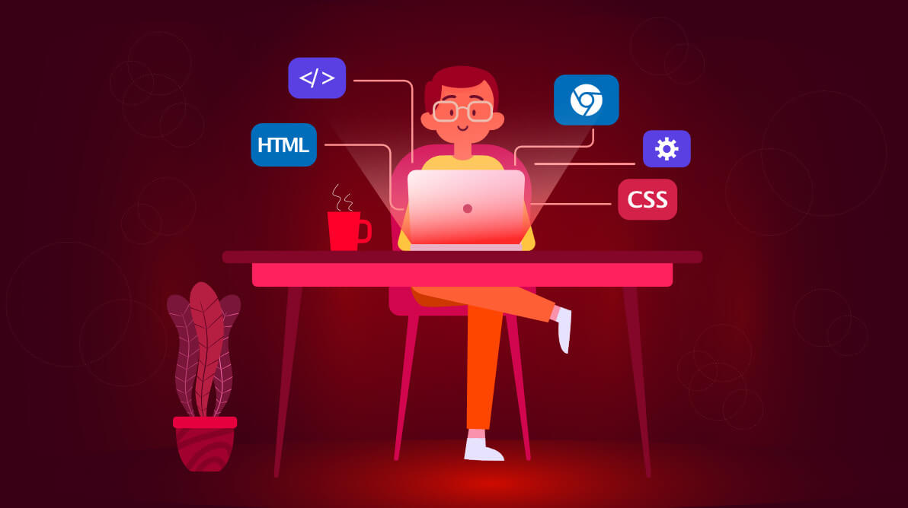
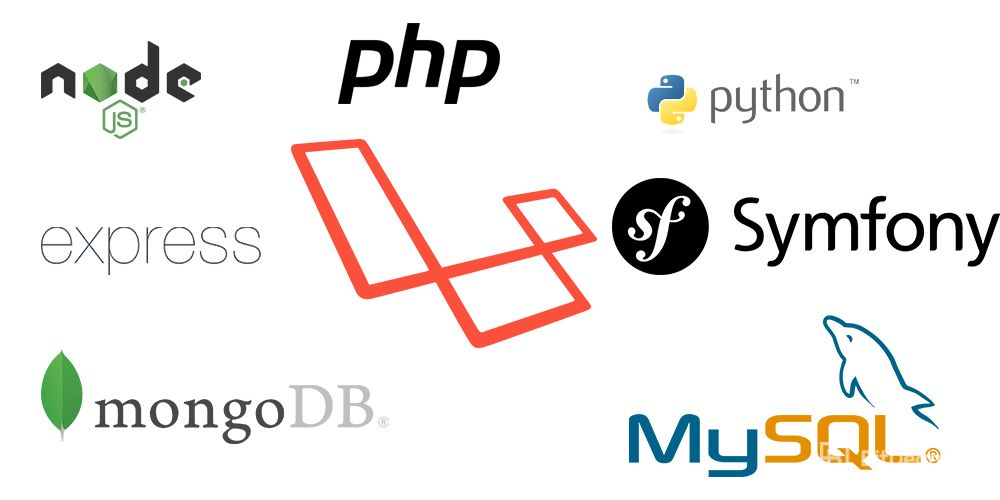
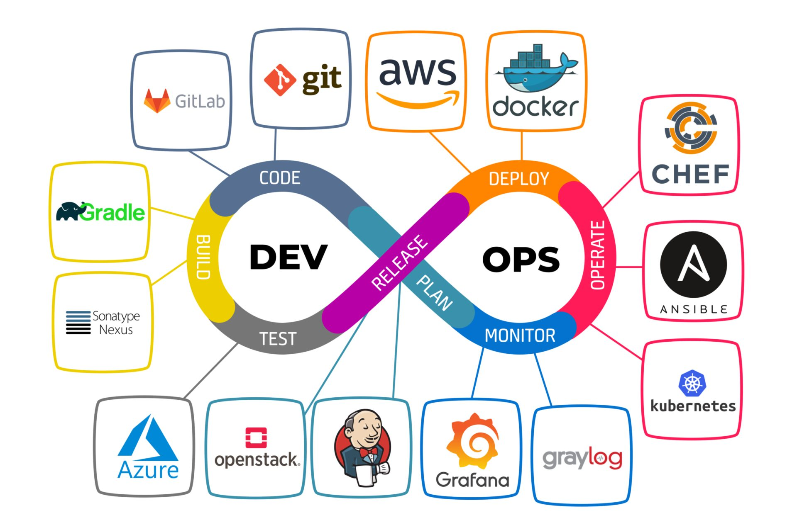
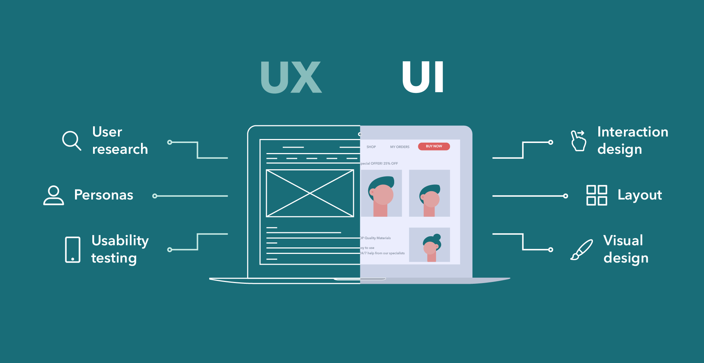
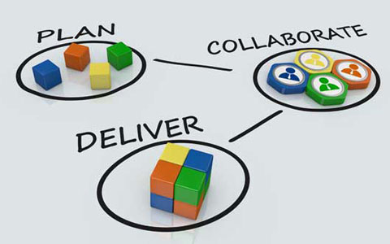
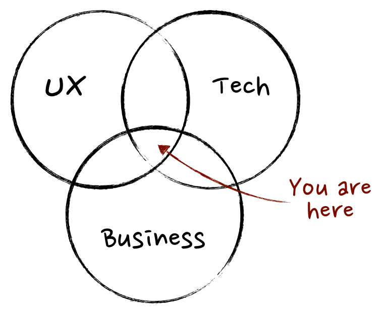

## Understanding Key Roles in Software Development

Colin Jaffe

Noble Desktop

---

---

#### No One Role

There are many, many possible roles a developer can have. We'll discuss a few, looking at what their needs, expectations, and focuses are.

---

#### Developer Roles

We'll be discussing the following roles:

- Front-End Developers
- Back-End Developers
- Full-Stack Developers
- Quality Assurance (QA) Engineers
- DevOps Engineers
- Web and UI/UX Designers
- Product and Project Managers

---

Front-End Developers

---

#### Front-End Developers: General Info

- **Focus:** Client-side development, user interfaces.
- **Why Companies Need Them:**
  - **User Experience:** Front-end developers create the application’s visual layer, directly impacting user satisfaction and retention.
  - **Brand and Usability:** They ensure the product is intuitive, accessible, and visually appealing, enhancing brand identity and user engagement.

---

#### Front-End Developers: Skills and Tools

- **Skills Required:**
  - Proficiency in HTML, CSS, JavaScript.
  - Knowledge of front-end frameworks (React, Angular, Vue.js).
  - Understanding of responsive design and cross-browser compatibility.
- **Tools & Technologies:**
  - **Frameworks:** React, Angular, Vue.js
  - **Design Tools:** Figma, Sketch
  - **Build Tools:** Webpack, Sass

---

#### Front-End Developers: What Makes Someone Effective

- **Empathy for Users:** Prioritizes user experience, ensuring the interface is easy to navigate and visually appealing.
- **Attention to Detail:** Focuses on design and code precision for a seamless user experience.
- **Adaptability:** Keeps up with design trends and technologies, ensuring the product remains relevant.

---

Back-End Developers

---

#### Back-End Developers: General Info

- **Focus:** Server-side logic, databases, APIs.
- **Why Companies Need Them:**
  - **Core Functionality:** They build and maintain systems that handle data, business logic, and server communication.
  - **Scalability and Security:** They design systems that can scale with growth while ensuring data is secure and efficiently managed.

---

#### Back-End Developers: Skills and Tools

- **Skills Required:**
  - Proficiency in server-side languages (Python, Java, Node.js).
  - Understanding of database management (SQL, NoSQL).
  - Experience with RESTful APIs and microservices.
- **Tools & Technologies:**
  - **Languages:** Python, Java, Node.js
  - **Databases:** MySQL, PostgreSQL, MongoDB
  - **Tools:** Docker, Kubernetes

---

#### Back-End Developers: What Makes Someone Effective

- **Problem-Solving Skills:** Designs solutions to complex data management challenges.
- **Focus on Scalability:** Builds systems that can handle increased demand without sacrificing performance.
- **Security Mindset:** Prioritizes security best practices to protect data and prevent breaches.

---

Full-Stack Developer

---

#### Full-Stack Developers: General Info

- **Focus:** Both front-end and back-end development.
- **Why Companies Need Them:**
  - **Versatility:** Handles both client and server-side development, reducing the need for specialized roles.
  - **Efficiency:** Manages the full project lifecycle, making them valuable for small teams or startups.

---

#### Full-Stack Developers: Skills and Tools

- **Skills Required:**
  - Everything from the previews two roles! (HTML, CSS, JavaScript, server-side languages, databases, etc.)
  - The ability to switch between front-end and back-end tasks seamlessly.
- **Tools & Technologies:**
  - **Front-End:** React, Angular, Vue.js
  - **Back-End:** Node.js, Express, Django
  - **Databases:** MySQL, MongoDB, PostgreSQL

---

#### Full-Stack Developers: What Makes Someone Effective

- **Versatility:** Comfortable switching between front-end and back-end tasks as needed.
- **Holistic Understanding:** Understands how all parts of the application interact for seamless integration.
- **Time Management:** Efficiently juggles multiple responsibilities to deliver features on time.

---

QA Engineer

---

#### QA Engineers: General Info

- **Focus:** Ensuring product quality through testing.
- **Why Companies Need Them:**
  - **Quality Control:** Catch bugs and issues before users do, ensuring a polished and reliable product.
  - **User Satisfaction:** Maintain high standards to prevent issues that could lead to customer dissatisfaction.

---

#### QA Engineers: Skills and Tools

- **Skills Required:**
  - Proficiency in testing tools and methodologies.
  - Strong analytical and problem-solving abilities.
  - Knowledge of the software development life cycle (SDLC) and agile methodologies.
- **Tools & Technologies:**
  - **Testing Tools:** Selenium, JUnit, LoadRunner
  - **Bug Tracking:** JIRA, Bugzilla
  - **CI/CD Tools:** Jenkins, CircleCI

---

#### QA Engineers: What Makes Someone Effective

- **Attention to Detail:** Identifies and documents even the smallest issues.
- **Curiosity and Thoroughness:** Explores all potential edge cases and scenarios.
- **Clear Communication:** Articulates issues clearly to developers and collaborates to resolve them.

---

DevOps Engineer

---

#### DevOps Engineers: General Info

- **Focus:** Bridging development and operations, ensuring continuous integration and delivery.
- **Why Companies Need Them:**
  - **Faster Releases:** Automate and streamline deployment processes for quicker and more reliable software releases.
  - **Operational Efficiency:** Improve collaboration between development and operations, reducing bottlenecks.

---

#### DevOps Engineers: Skills and Tools

- **Skills Required:**
  - Proficiency in cloud platforms (AWS, Azure, GCP).
  - Knowledge of infrastructure-as-code (IaC) tools like Terraform.
  - Experience with containerization and orchestration (Docker, Kubernetes).
- **Tools & Technologies:**
  - **CI/CD Tools:** Jenkins, Travis CI
  - **Containerization:** Docker, Kubernetes
  - **IaC Tools:** Terraform, Ansible

---

#### DevOps Engineers: What Makes Someone Effective

- **Automation Mindset:** Seeks opportunities to automate processes, reducing manual effort and errors.
- **Collaboration Skills:** Bridges the gap between development and operations, ensuring smooth releases.
- **Problem-Solving:** Quickly identifies and resolves issues in production environments, minimizing downtime.

---

Web Designers

---

#### Web Designers: General Info

- **Focus:** Visual design and layout of websites.
- **Why Companies Need Them:**
  - **Aesthetic Appeal:** Web designers ensure that websites are visually appealing and align with the brand’s identity.
  - **User Engagement:** They create layouts that attract and retain users, which is crucial for conversions and user retention.

---

#### Web Designers: Skills and Tools

- **Skills Required:**
  - Proficiency in graphic design principles.
  - Knowledge of color theory, typography, and layout.
  - Basic understanding of HTML, CSS, and responsive design.
- **Tools & Technologies:**
  - **Design Tools:** Adobe Photoshop, Illustrator, Sketch
  - **Prototyping Tools:** Figma, Adobe XD
  - **Wireframing:** Balsamiq, InVision

---

#### Web Designers: What Makes Someone Effective

- **Creativity:** An effective web designer combines creativity with an understanding of user behavior to create visually compelling designs.
- **Attention to Detail:** They ensure consistency in design elements, creating a cohesive and professional look across the website.
- **Collaboration:** They work closely with developers to ensure designs are implemented correctly and meet technical requirements.

---

UI/UX Designers

---

#### UI/UX Designers: General Info

- **Focus:** User interface (UI) and user experience (UX) design, ensuring that products are intuitive and user-friendly.
- **Why Companies Need Them:**
  - **User-Centered Design:** UI/UX designers ensure that digital products are easy to use, meeting the needs and expectations of users.
  - **Increased Conversion:** By improving the user experience, they help increase engagement, satisfaction, and conversion rates.

---

#### UI/UX Designers: Skills and Tools

- **Skills Required:**
  - Proficiency in user research and testing methods.
  - Strong understanding of interaction design and information architecture.
  - Knowledge of wireframing and prototyping techniques.
- **Tools & Technologies:**
  - **Design Tools:** Sketch, Adobe XD
  - **Prototyping:** Figma, InVision
  - **User Testing:** UsabilityHub, Hotjar

---

#### UI/UX Designers: What Makes Someone Effective

- **User Empathy:** Effective UI/UX designers deeply understand user needs and pain points, crafting solutions that resonate with the target audience.
- **Iterative Mindset:** They embrace feedback and continuously refine designs based on user testing and data analysis.
- **Problem-Solving Skills:** They excel at designing intuitive interfaces that simplify complex processes for users.

---

Project Managers

---

#### Project Managers: General Info

- **Focus:** Planning, executing, and closing projects, ensuring they are completed on time, within scope, and on budget.
- **Why Companies Need Them:**
  - **Efficient Execution:** Project managers streamline processes, ensuring that projects are completed efficiently and meet business objectives.
  - **Risk Management:** They identify and mitigate risks, ensuring that projects stay on track despite potential obstacles.

---

#### Project Managers: Skills and Tools

- **Skills Required:**
  - Proficiency in project planning, scheduling, and resource allocation.
  - Strong leadership and team management skills.
  - Knowledge of risk management and problem-solving techniques.
- **Tools & Technologies:**
  - **Project Management Tools:** Asana, Microsoft Project, Trello
  - **Collaboration Tools:** Slack, Microsoft Teams
  - **Reporting Tools:** Excel, Power BI

---

#### Project Managers: What Makes Someone Effective

- **Organizational Skills:** Effective project managers are highly organized, capable of managing multiple tasks, timelines, and resources.
- **Communication:** They excel at keeping all stakeholders informed and engaged, ensuring everyone is aligned with the project goals.
- **Problem-Solving:** They anticipate and address challenges proactively, ensuring that the project stays on track and within scope.

---

Product Managers

---

#### Product Managers: General Info

- **Focus:** Overseeing the development and lifecycle of a product, from concept to launch.
- **Why Companies Need Them:**
  - **Strategic Vision:** Product managers align the product with business goals, ensuring it meets market demands and drives revenue.
  - **Cross-Functional Leadership:** They coordinate between various teams (development, marketing, sales) to deliver a successful product.

---

#### Product Managers: Skills and Tools

- **Skills Required:**
  - Strong understanding of market research and product strategy.
  - Ability to define and prioritize product features based on user needs and business objectives.
  - Excellent communication and leadership skills.
- **Tools & Technologies:**
  - **Roadmapping Tools:** Aha!, ProductPlan
  - **Project Management:** Jira, Trello
  - **Analytics Tools:** Google Analytics, Mixpanel

---

#### Product Managers: What Makes Someone Effective

- **Customer Focus:** Effective product managers deeply understand the customer’s needs, translating them into valuable product features.
- **Decision-Making:** They excel at making informed decisions based on data, balancing short-term needs with long-term vision.
- **Leadership:** They inspire and align cross-functional teams, ensuring everyone is working towards a common goal.

---

#### Summary and Key Takeaway

As someone in software development, understanding these roles can help you identify your interests and strengths, guiding your career path.

There are many roles in software development, so explore and find what suits you best!

---

---

## What Questions Do You Have?

